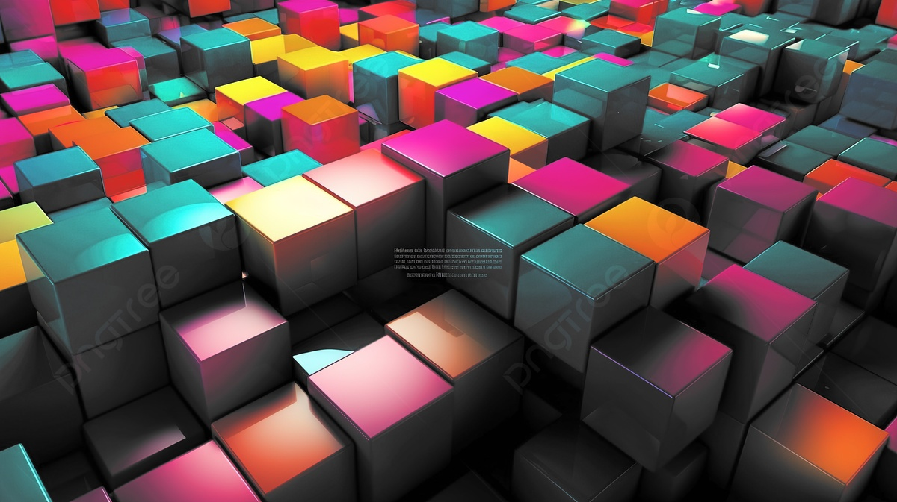

# Selective Image Desaturation Application

This project is a software application developed as part of the "Basics of Computer Graphics" course. The application performs selective desaturation of an image based on user-defined criteria.

## Project Description

The goal of this project is to create software that can load an image file in JPG format, partially desaturate it based on user settings, display the modified image, and save the output to a file.

## Basic Usage Instructions

1. **Loading an Image**:
   - The program allows you to load a JPG image file through the `File` menu by selecting `Open`.
   
2. **Displaying Images**:
   - Once loaded, the original image will be displayed in one window, and the desaturated version will be shown in another.

3. **Adjusting Desaturation**:
   - Use the sliders to adjust the level of desaturation. 
     - **Lightness**: Controls the threshold for desaturating pixels based on brightness.
     - **RGB**: Controls the desaturation threshold for each of the RGB color components.
     - **CMY**: Controls the desaturation threshold for each of the CMY color components.
     - **Hue**: Allows setting the hue range for desaturation and adjusting the transition from color to grayscale.
   - The `Partial Desaturation` slider allows for smooth transitions between color and grayscale areas.

4. **Saving the Image**:
   - To save the modified image, use the `File` menu and select `Save`. The image will be saved in JPG format.

5. **Help and Support**:
   - Access the `Help` menu for more information about using the application.

# Examples

